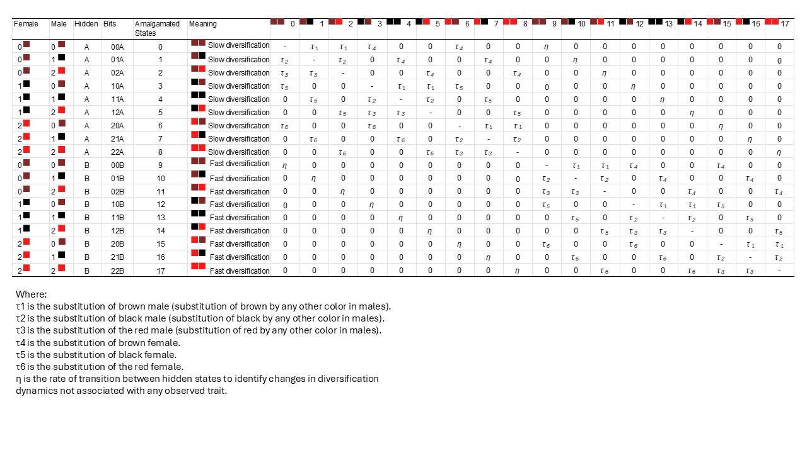
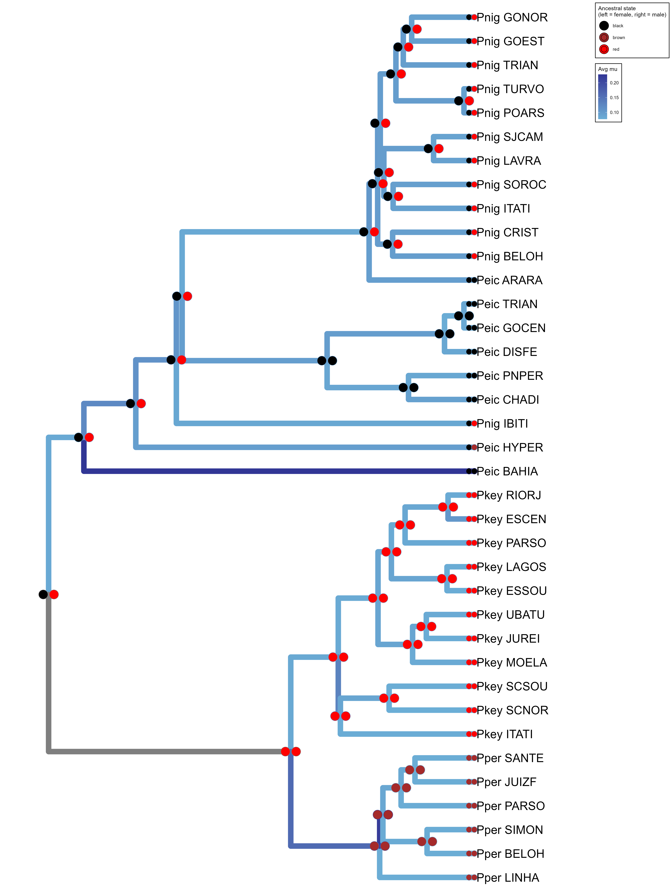
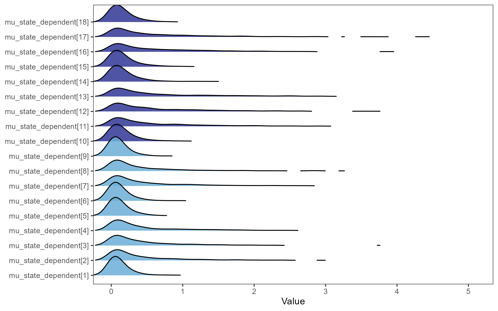
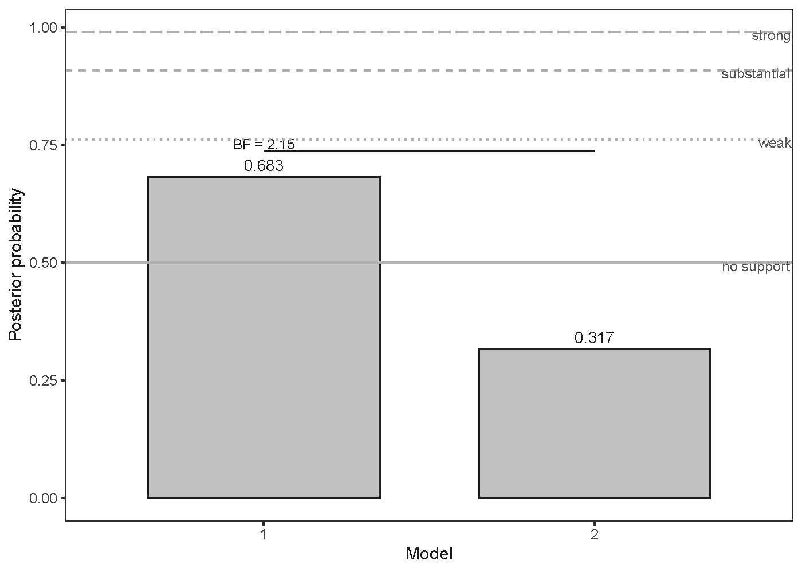
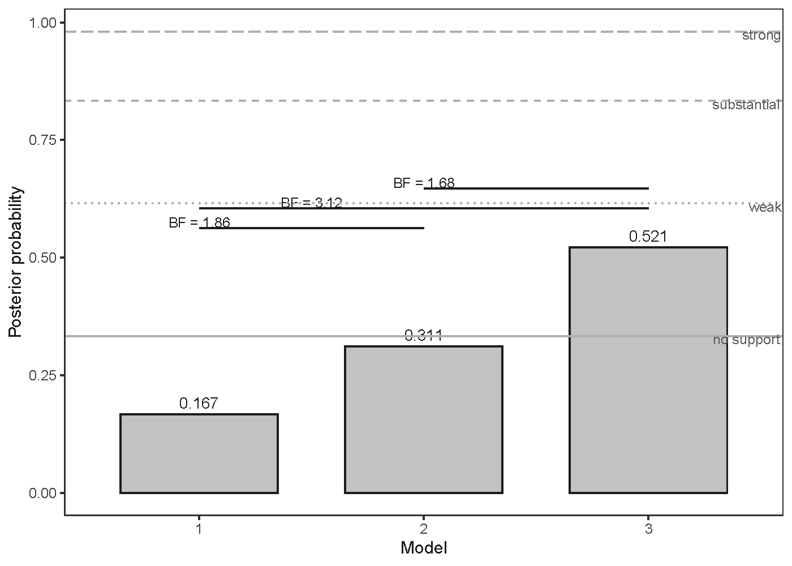
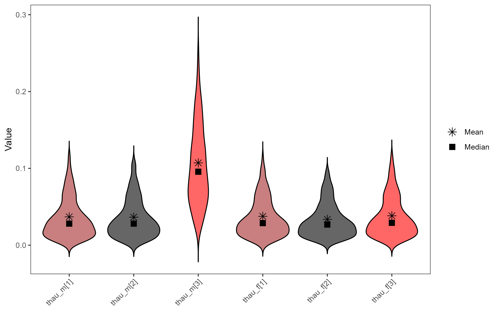

# SeDHiSSE
 Sexually Dimorphic and Hidden State Dependent Speciation and Extinction

## Introduction 

This tutorial explains the details of how to set-up a SeDHiSSE analyses in RevBAyes as done in Azevedo et al (submited).

SeDHiSSE is a an extension of the State Dependent Speciation and Extinction model for multiple observed and hidden states (SSE, Maddison et al. 2007; FitzJohn 2012; Beaulieu and O’Meara 2016; Herrera-Alsina et al. 2019), in which we accounted for the sexual dimorphism observed in our system by integrating Pagel-style correlated evolution (Pagel 1997) of male and female traits. We modelled female and male observed coloration as separate, and possibly coevolving, traits (Pagel 1997), and with different combinations of male and female traits (i.e. amalgamated character state) having distinct influences on  diversification processes. Direct transition between monomorphic conditions (male and females with same color) were not allowed, such that a dimorphic state is required before a population becomes monomorphic (Revell and Harmon 2022). We used two hidden states (rate regimes) to account for other (unobserved) sources of variation in birth and death rates, reducing the chance of false positives (Beaulieu and O’Meara 2016; Herrera-Alsina et al. 2019). Figure 1 show a graphic representation of the rates estimated with the model.

<figure>

    <figcaption>Figure 1. Ventral abdominal color evolution on SeDHiSSE model. Schematic representation of the SeDHiSSE model with the observed (circles) and hidden states (square) combinations, possible transition rates (arrows between states), extinction rates (curved line with circular head), and population formation (birth) rates (curved, self-pointed arrows). Female color states are represented in the left half of the circle, and males on the right. Numbers and colors represent the abdominal color state (0 brown, 1 black and 2 red). Left side of the panel marked with hidden state (square) A represents possible slow birth and extinction rates not explained by the observed traits, while the right side with state B represents possible greater rates not explained by the observed traits. Brown arrows represent substitution brown abdomen state by any other, black arrows represent substitution of black state, and red arrows represent substitution of red state, and grey arrows represent transition between hidden states (rate regimes). Arrow style distinguished the transitions between females (solid), males (dashed) and hidden states (dotted).</figcaption>
</figure>

> [!Note]
> Because our analyses were conducted on a population-level tree, the “birth” parameter, typically interpreted as speciation in species-level SSE models, is here reinterpreted as the rate of population lineage formation (i.e., branching events). This interpretation is consistent with protracted birth–death models, in which lineage branching and speciation completion are independent processes, with speciation modeled as an anagenetic, protracted event distinct from lineage birth–death dynamics (Rosindell et al. 2010; Lambert et al. 2015; Li et al. 2018; Sukumaran et al. 2021; Hua et al. 2022). Our approach is intentionally agnostic with respect to the protracted speciation rate, and excluding completion rate does not bias estimation of lineage birth and extinction parameters, which are the focus of our analyses. The results are subsequently integrated with other tests within the RRC framework to inform species delimitation.

The whole DAG representation of the SeDHiSSE model used here can be seen in Figure 2:
<figure>

    <figcaption>Figure 2. Directional Acyclic Graph (DAG) representation of the SeDHiSSE model, with parameters and relationship between them as well as the priors used.</figcaption>
</figure>

  
We are interested in testing (1) whether any combination of male and female colors had been disfavored (selected against) or (2) whether any color on any sex had ben disfavored during their evolutionary time.

>[!Important]
> If you use this model, please refer to this GitHub page and cite Azevedo et al. (in prep)  
>  
> Azevedo G.H.F., Oliveira U., Santos F.R., Brescovit A.D, Santos A.J. (submited). Testing cohesive selective paths and evaluating information loss while delimiting species of Brazilian wandering spiders
 

## Setup  

This tutorial requires [RevBayes](https://revbayes.github.io/) with the [Tensorphylo (May and Meyer)](https://bitbucket.org/mrmay/tensorphylo/src/a1314e61f180bd46a4de529bc6d26c434d1d442a/doc/preprint/preprint.pdf) plugin. [Download RevBayes](https://revbayes.github.io/download) or check the [RevBayes compilation instruction page](https://revbayes.github.io/compile-linux). Follow the instruction for [installing Tensorhylo here](https://bitbucket.org/mrmay/tensorphylo/src/master).


## SeDHiSSE in RevBayes  
### Getting started

Clone this github directory, start RevBayes from your [scripts](./scripts) directory and load tensor file.  

```R
git clone LINK

cd sedhisse/scripts

rb 
```  

Set seed if you want to replicate the analysis.
```R
seed(1)
```  

#### Inputs and Outputs
Set the path to inputs and outputs  

```R
workDirPath = "../"
dataDirPath = workDirPath + "data/"
outDirPath = workDirPath + "outputs/"
outputPrefix = "Pho_SeDHiSSE"
dataMatrix = dataDirPath + "Pho_PolyColorMatrix.tsv"
treeFile = dataDirPath + "Pho_Trees.tre" 
# set tensorphylo path 
tensor_path = "/home/ghfa/programs/tensorphylo/build/installer/lib"
``` 
Create helpers variables vor the moves and monitors.
```R
moves = VectorMoves()
monitors = VectorMonitors()
```  

#### Fixed parameters of the model
To facilitate, we define all fixed variables in the beginning so we can easily change them in the future if needed.

```R

# Number of combined character states
n_states_male <- 3 
n_states_female <- 3
n_states = n_states_male * n_states_female

# Which tree in the tree file will be used for reconstruction of character state
tree_to_use <- 2

# define the rate (1/mean) of the exponential distribution of character substitution rates
zeta_exp_rate <- 10

# define the rate (1/mean) of the exponential distribution transition between rate regimes (hidden states)
eta_exp_rate <- 1

# define the rate (1/mean) of the exponential distribution of extinction and lineage birth rates
mu_exp_rate <- 1/10
lambda_exp_rate  <- 1/10

# define number of hidden state rates
n_hidden <- 2

# Set the minimum and maximum sampling frequency
n_min = 0.33
n_max = 0.66

# Number of cores to use
n_cores=21
```

#### Helper variables and plugins
Create some vector for the moves and monitors of this analysis
```R
moves    = VectorMoves()
monitors = VectorMonitors()

# Load Plugins
loadPlugin("TensorPhylo", tensor_path)
```

### The Data  

We are analyzing the main ventral color of the abdomen that is present in three states:

| Ventral_Color | State  |  
| --------------|--------|  
| Brown         | 0      |  
| Black         | 1      |  
| Red             | 2      |  
 
This trait can be sexually dimorphic, so we can have a matrix with two traits, one for the male and another for the female:

| Female_Ventral_Color_State | Male_Ventral_Color_State  | 
| --------------|--------|  
| 0         | 0      |  
| 1         | 1      |  
| 2         | 2      |  

Therefore there are 9 possible combination of states in both females and males:

| Female | Male | Bits | Combined State |  
|--------|------|------|----------------|  
| 0      | 0    | 00  -| 0               |  
| 0      | 1    | 01  -| 1              |  
| 0      | 2    | 02  -| 2              |  
| 1      | 0    | 10  -| 3              |  
| 1      | 1    | 11  -| 4              |  
| 1      | 1    | 12  -| 5              |  
| 2      | 0    | 20  -| 6              |  
| 2      | 1    | 21  -| 7              |  
| 2      | 2    | 22  -| 8              |  

>[!Note]
> This is only the observed states. We will add the hidden states later in the tutorial.

Each terminal in our data matrix should have one of the nine combined states.  
> [!Note]
> Since it is a sexual dimorphism, only the combination of two states is allowed. You can work on other types of polymorphisms and allow for any number of combinations you think it makes sense for your data. Remember that the more final states you have, more complex is the model similar to what is commented for biogeographical models [here]().

Now that we know the structure of the data we can read the matrix

Read data matrix and indicate number of states
```R
data_matrix = readCharacterDataDelimited(dataMatrix, stateLabels=n_states, type="NaturalNumbers", delimiter="\t", header=TRUE)
```  
Expand the matrix to account for hidden states
```R
data_matrix_exp <- data_matrix.expandCharacters( n_hidden )
```

Read Tree  
```R
trees <- readTrees(treeFile)
# Since our file has more than one tree, we need to indicate which are we using. We chose the MSC+Morphology tree (index = 2).
tree_to_use <- 2
phylogeny := trees[tree_to_use]
# If you have just one tree use:
# phylogeny <-  readTrees(treeFile)[1]
```

Get taxa 
```R
taxa = trees[tree_to_use].taxa()
```  

### Trait substitution rates (Q matrix)
Only trait transitions that represents a single sex change is allowed. Since we are interested in the rates in which color in each sex is replaced by others, we used six transition rates.

We want a rate matrix that would look like this for the observed states:  

|   | 0  | 1   | 2    | 3   | 4   | 5   | 6   | 7   | 8   |  
|---|---|---|---|---|---|---|---|---|---| 
|0    | -     | τ_m<<sub>1</sub> | τ_m<<sub>1</sub> | τ_f<<sub>1</sub> | 0     | 0     | τ_f<<sub>1</sub> | 0     | 0
|1    | τ_m<<sub>2</sub> | -     | τ_m<<sub>2</sub> | 0     | τ_f<<sub>1</sub> | 0     | 0     | τ_f<<sub>1</sub> | 0
|2      | τ_m<<sub>3</sub> | τ_m<<sub>3</sub> | -     | 0     | 0     | τ_f<<sub>1</sub> | 0     | 0     | τ_f<<sub>1</sub>
|3    | τ_f<<sub>2</sub> | 0     | 0     | -     | τ_m<<sub>1</sub> | τ_m<<sub>1</sub> | τ_f<<sub>2</sub> | 0     | 0
|4    | 0     | τ_f<<sub>2</sub> | 0     | τ_m<<sub>2</sub> | -     | τ_m<<sub>2</sub> | 0     | τ_f<<sub>2</sub> | 0
|5      | 0     | 0     | τ_f<<sub>2</sub> | τ_m<<sub>3</sub> | τ_m<<sub>3</sub> | -     | 0     | 0     | τ_f<<sub>2</sub>
|6      | τ_f<<sub>3</sub> | 0     | 0     | τ_f<<sub>3</sub> | 0     | 0     | -     | τ_m<<sub>1</sub> | τ_m<<sub>1</sub>
|7      | 0     | τ_f<<sub>3</sub> | 0     | 0     | τ_f<<sub>3</sub> | 0     | τ_m<<sub>2</sub> | -     | τ_m<<sub>2</sub>
|8        | 0     | 0     | τ_f<<sub>3</sub> | 0     | 0     | τ_f<<sub>2</sub> | τ_m<<sub>3</sub> | τ_m<<sub>3</sub> | -


Where: 
τ_m<<sub>1</sub> is the transition away from brown male (substitution of brown by any other color in males).  
τ_m<<sub>2</sub> is the transition away from black male (substitution of black by any other color in males).  
τ_m<<sub>3</sub> is the transition away from the red male (substitution of red by any other color in males).  

τ_f<<sub>1</sub> is the transition away from brown female.  
τ_f<<sub>2</sub> is the transition away from black female.  
τ_f<<sub>3</sub> is the transition away from the red female.  

We create a global transition rate for each sex, and then we use a Dirichlet distribution to sample proportional rates. The final rate is the product of the proportional rates and the global rate. 

```R
zeta ~ dnExp(zeta_exp_rate)
moves.append(mvScale(zeta, weight=1))
```

Since we want to test different hypotheses about the transition, we create three different proportional transition models.
  
Transition Model 1: all rates are equal (regardless of state or sex)
```R
zeta_proportional_m1 <- simplex(rep(1,n_states_male+n_states_female))
for (i in 1:n_states_male) {
    zeta_prop_male_m1[i] := zeta_proportional_m1[i]
}
for (i in 1:n_states_female) {
    zeta_prop_female_m1[i] := zeta_proportional_m1[n_states_male+i]
}
```
Transition Model 2: all rates are different
```R
zeta_proportional_m2 ~ dnDirichlet(rep(1,n_states_male+n_states_female))
moves.append( mvDirichletSimplex( zeta_proportional_m2, weight=1 ) )

for (i in 1:n_states_male) {
    zeta_prop_male_m2[i] := zeta_proportional_m2[i]
}
for (i in 1:n_states_female) {
    zeta_prop_female_m2[i] := zeta_proportional_m2[n_states_male+i]
}
```

Transition Model 3: red males have different from the rest thau_m1 == thau_m2 == thau_f1 == thau_f2 == thau_f3 != thau_m3 . Weights (a, a, b, a, a, a)  
```R
zeta_proportional_m3 ~ dnDirichlet(rep(1, 2))
moves.append( mvDirichletSimplex( zeta_proportional_m3, weight=1 ) )

for (i in 1:n_states_male) {
    zeta_prop_male_m3[i] := ifelse( i != 3, zeta_proportional_m3[1]/5, zeta_proportional_m3[2])
}
for (i in 1:n_states_female) {
    zeta_prop_female_m3[i] := zeta_proportional_m3[1]/5
}
```

Now we create transition model vector and indicator, and use a Categorical distribution to jump between each model with equal probabilities (rjMCMC).
```R
zeta_prop_vector_m := v(zeta_prop_male_m1, zeta_prop_male_m2,
                           zeta_prop_male_m3)
						   
zeta_prop_vector_f := v(zeta_prop_female_m1, zeta_prop_female_m2,
                           zeta_prop_female_m3)

zeta_model_indicator ~ dnCategorical(simplex(rep(1,zeta_prop_vector_m.size())))
moves.append( mvRandomGeometricWalk(zeta_model_indicator, weight=10.0, tune=TRUE))
```

The posterior distribution of zeta_model_indicator will indicate the probability of each of the 3 models. We also can create variables to track the probability of each model in relation to all others.

```R
# Probability of Model 1
is_transition_equal := ifelse( zeta_model_indicator == 1, 1, 0 )
# Probability of Model 2
is_all_transition_different := ifelse( zeta_model_indicator == 2, 1, 0 )
# Probability of Model 3
is_red_male_different := ifelse( zeta_model_indicator == 3, 1, 0 )
```

The transition between the observed states is a product of the proportional vector and the global transition. So we create the observed states transition:
```R
thau_m := zeta_prop_vector_m[zeta_model_indicator]*zeta
thau_f := zeta_prop_vector_f[zeta_model_indicator]*zeta
```

Now we create the observed part of the Q matrix based on the transition (substitution)

```R
r[1][1] <- 0
r[1][2] := thau_m[1]
r[1][3] := thau_m[1]
r[1][4] := thau_f[1]
r[1][5] <- 0
r[1][6] <- 0
r[1][7] := thau_f[1]
r[1][8] <- 0
r[1][9] <- 0

r[2][1] := thau_m[2]
r[2][2] <- 0
r[2][3] := thau_m[2]
r[2][4] <- 0
r[2][5] := thau_f[1]
r[2][6] <- 0
r[2][7] <- 0
r[2][8] := thau_f[1]
r[2][9] <- 0

r[3][1] := thau_m[3]
r[3][2] := thau_m[3]
r[3][3] <- 0
r[3][4] <- 0
r[3][5] <- 0
r[3][6] := thau_f[1]
r[3][7] <- 0
r[3][8] <- 0
r[3][9] := thau_f[1]

r[4][1] := thau_f[2]
r[4][2] <- 0
r[4][3] <- 0
r[4][4] <- 0
r[4][5] := thau_m[1]
r[4][6] := thau_m[1]
r[4][7] := thau_f[2]
r[4][8] <- 0
r[4][9] <- 0

r[5][1] <- 0
r[5][2] := thau_f[2]
r[5][3] <- 0
r[5][4] := thau_m[2]
r[5][5] <- 0
r[5][6] := thau_m[2]
r[5][7] <- 0
r[5][8] := thau_f[2]
r[5][9] <- 0

r[6][1] <- 0
r[6][2] <- 0
r[6][3] := thau_f[2]
r[6][4] := thau_m[3]
r[6][5] := thau_m[3]
r[6][6] <- 0
r[6][7] <- 0
r[6][8] <- 0
r[6][9] := thau_f[2]

r[7][1] := thau_f[3]
r[7][2] <- 0
r[7][3] <- 0
r[7][4] := thau_f[3]
r[7][5] <- 0
r[7][6] <- 0
r[7][7] <- 0
r[7][8] := thau_m[1]
r[7][9] := thau_m[1]

r[8][1] <- 0
r[8][2] := thau_f[3]
r[8][3] <- 0
r[8][4] <- 0
r[8][5] := thau_f[3]
r[8][6] <- 0
r[8][7] := thau_m[2]
r[8][8] <- 0
r[8][9] := thau_m[2]

r[9][1] <- 0
r[9][2] <- 0
r[9][3] := thau_f[3]
r[9][4] <- 0
r[9][5] <- 0
r[9][6] := thau_f[3]
r[9][7] := thau_m[3]
r[9][8] := thau_m[3]
r[9][9] <- 0
``` 

Create a variable with a more objective names to track the transitions:
```R
substitution_of_brown_male := thau_m[1]
substitution_of_black_male := thau_m[2]
substitution_of_red_male := thau_m[3]

substitution_of_brown_female := thau_f[1]
substitution_of_black_female := thau_f[2]
substitution_of_red_female := thau_f[3]
```

We assume equal transition rates between hidden states (diversification regimes)
```R
eta ~ dnExponential(eta_exp_rate)
moves.append( mvScale(eta,lambda=0.5,tune=true,weight=5) )

for (i in 1:(n_hidden * (n_hidden - 1))) {
    HR[i] := eta
}
```  
Now you can create the rate matrix combining the observed and hidden states. We do not rescale because we are using absolute rates (not relative rates).

```R
Q := fnHiddenStateRateMatrix(r, HR, rescaled=false)

```

Now the matrix should look like this:



### Lineage extinction rates
We used a global extinction rates, where the state specific is a fraction of that rate. 
Note that this is for both rate regimes (Sum of slow and Fast). 
The proportional contribution for each regime will be specified further below. 
```R
mu_global ~ dnExp(mu_exp_rate)
moves.append(mvScale(mu_global, weight=1))
```

We use RJ to test for equal rates between focal states, that is, the states found in our focal putative species: 
brown/brown (P. pertyi), black/black (P. eickstedtae), black/red (P. nigriventer), and red/red (P. keyserlingi).
We tested two models, one with focal rates equal and other rates fre to vary, and another with all rates varying.

Detah Model 1: focal rates equal, all the remaining are free to vary
Note that in this model we have 6 rates, 1 for the focal and 5 for the remaining states.

```R
total_rates_m01 = 6
mu_m1_weigths ~ dnDirichlet(rep(1,total_rates_m01))
moves.append( mvSimplex(mu_m1_weigths, weight=5.0) )
```R
The last value of the simplex we considered to be the total contribution of focal states (it actualy could be anyone, but this will facilitate coding below). Therefore, we need to divide it by four for each of the focal states. Our focal rates correspond to the states 1, 5, 6 and 9 of our observed amalgamated state matrix.

```R
focal_states <- [1, 5, 6, 9]
n_focal_states = 4
n_states = 9

mu_proportional_m1[1] := mu_m1_weigths[total_rates_m01]/n_focal_states
mu_proportional_m1[2] := mu_m1_weigths[1]
mu_proportional_m1[3] := mu_m1_weigths[2]
mu_proportional_m1[4] := mu_m1_weigths[3]
mu_proportional_m1[5] := mu_m1_weigths[total_rates_m01]/n_focal_states
mu_proportional_m1[6] := mu_m1_weigths[total_rates_m01]/n_focal_states
mu_proportional_m1[7] := mu_m1_weigths[4]
mu_proportional_m1[8] := mu_m1_weigths[5]
mu_proportional_m1[9] := mu_m1_weigths[total_rates_m01]/n_focal_states
```R

Detah Model 2: all rates are free to vary
Our second model have the same number of rates as the total amalgamated states. Therefore, it is easier to create.

```R
total_rates_m02 = n_states
mu_proportional_m2 ~ dnDirichlet(rep(1,total_rates_m02))
moves.append( mvSimplex(mu_proportional_m2, weight=5.0) )
```

Create observed states extinction model vector and indicator
```R
mu_prop_model_vector := v(mu_proportional_m1,
                           mu_proportional_m2)

mu_prop_model_indicator ~ dnCategorical(simplex(rep(1,mu_prop_model_vector.size())))
moves.append( mvRandomGeometricWalk(mu_prop_model_indicator, weight=10.0, tune=TRUE))

mu_obs_prportional := mu_prop_model_vector[mu_prop_model_indicator]
```

All observed rates are mutiplied by the global rate to get the global state death (i.e the total contribution of a state in both rate regimes)
```R
mu_obs := mu_obs_prportional * mu_global
```

Track the probability of focal extinction being equal. 1 means yes, 0 means no
```R
is_focal_death_equal := ifelse(mu_prop_model_indicator == 1, 1, 0 )
```R

Note that: 
mu_obs[1] correspond to brown/brown [P. pertyi] in both diversification regimes
mu_obs[5] correspond to black/black [P. eickstedtae] in both diversification regimes
mu_obs[6] correspond to black/red [P. nigriventer] in both diversification regimes
mu_obs[9] correspond to red/red [P. keyserlingi] in both diversification regimes  

You can create variable with more interpretable names just to track species specifica total extinction rate, regardless of diversification regime.

```R
extinction_per := mu_obs[1]
extinction_eic := mu_obs[5]
extinction_nig := mu_obs[6]
extinction_key := mu_obs[9] 
```

### Lineage birth rates  
Since we are using a population tree, these rates represent the probability of population formation (fragmentation of a population in two genetic groups).
We assume that all global state specific birth rates are the same (rate independent of state) because we have no hypothesis on how states could contribute to population formation.

```R
lambda_global ~ dnExp(lambda_exp_rate )
moves.append(mvScale(lambda_global, weight=1))

for (i in 1:n_states){
    lambda_obs[i] := lambda_global / n_states
    }
```

### Different diversification regimes (Hidden state speciation and extinction rates) 

We assume two different diversification regimes: slow and fast.
We used a distribution discretization approach (Höhna et al. 2019) to draw two proprtional birth/deat rates, and then multiply the proprtional rates by the each glomal observed state specific rates (extinction_rates_obs) to create the tw regimes
We used RJ to visit a model where there are two rates regimes (different rates for each hidden state) and  a model with only one regime (rates of both hidden states are equal)
A model where the standard deviation of the rate variation distribution is 0, would indicate one single regime

```R
lambda_hidden_lnMean <- ln(1.0)
lambda_hidden_sd_distr_m0 = 1.0 / 0.587405
lambda_hidden_sd_distr_m1 = 0.0
lambda_hidden_upsilon = dnExponential( lambda_hidden_sd_distr_m0)
lambda_hidden_sigma ~ dnReversibleJumpMixture( lambda_hidden_sd_distr_m1, lambda_hidden_upsilon, p=0.5 )
moves.append( mvScale( lambda_hidden_sigma, weight=1 ) )
moves.append( mvRJSwitch(lambda_hidden_sigma , weight=1.0) )
```
We track the probability of having two different birth rate regimes (0 means no, one means yes) 
```R
is_there_different_birth_regimes := ifelse(lambda_hidden_sigma == 0, 0, 1)
```

Create each relative rates for both hidden sates and normalized them so it sums to one (proportional rates)
```R
lambda_hidden_density = dnLognormal(lambda_hidden_lnMean, lambda_hidden_sigma)
lambda_hidden_unormalized := fnDiscretizeDistribution( lambda_hidden_density, n_hidden )
lambda_hidden := lambda_hidden_unormalized / sum(lambda_hidden_unormalized)
```

We do the same for the extinction (death)

```R
mu_hidden_lnMean <- ln(1.0)
mu_hidden_sd_distr_m0 = 1.0 / 0.587405
mu_hidden_sd_distr_m1 = 0.0
mu_hidden_upsilon = dnExponential( mu_hidden_sd_distr_m0)
mu_hidden_sigma ~ dnReversibleJumpMixture( mu_hidden_sd_distr_m1, mu_hidden_upsilon, p=0.5 )
moves.append( mvScale( mu_hidden_sigma, weight=1 ) )
moves.append( mvRJSwitch(mu_hidden_sigma , weight=1.0) )

is_there_different_death_regimes := ifelse(mu_hidden_sigma == 0, 0, 1)

mu_hidden_density = dnLognormal(mu_hidden_lnMean, mu_hidden_sigma)
mu_hidden_unormalized := fnDiscretizeDistribution( mu_hidden_density, n_hidden )

mu_hidden := mu_hidden_unormalized / sum(mu_hidden_unormalized)
```

#### Combining Hidden and observed diversification
Combine observed and hidden rates to create the state specific rates for all 18 states (9 for each diversification regime). 
We use a loop for that.

for (j in 1:n_hidden) {
    for (i in 1:n_states) {
        index = i+(j*n_states)-n_states
        lambda_state_dependent[index] := lambda_obs[i] * lambda_hidden[j]
        mu_state_dependent[index] := mu_obs[i] * mu_hidden[j]
    }
}


### Prior on root state
 We are using a flat Dirichlet distribution as the prior on each state. 
 
```R
root_state_freq ~ dnDirichlet(rep(1,data_matrix_exp.maxStates()))
moves.append(mvSimplex(root_state_freq, weight=1))
```

### The probability of sampling an extant population
Since we have a population tree, our rho parameter represents the probability of sampling a population.
This can be difficult to know. We will use a uniform distribution between 0.33 and 0.66, assuming that we have sample around two and three thirds of all populations. Wrong specification of priors is expected to affect absolute values, but the relative rates (focus of the study) is expected to be robust.

```R
sampling_fraction ~ dnUniform(n_min, n_max)
moves.append( mvScale(sampling_fraction, weight=1) )
```  

### The time tree model
Lastly, we create an stochastic node for the time tree and associate it with the observed phylogeny and the data matrix.
```R
# Using tensorphylo
timetree ~ dnGLHBDSP(
    rootAge     = root_age,
    lambda      = lambda_state_dependent,
    mu          = mu_state_dependent,
    eta         = Q,
    pi          = root_state_freq,
    condition   = "time",
    nStates     = data_matrix_exp.maxStates(),
    taxa        = taxa,
    rho         = sampling_fraction,
    nProc       = n_cores
)

# Without tensorphylo
#timetree ~ dnCDBDP( rootAge           = root_age,
#                    speciationRates   = lambda_state_dependent,
#                    extinctionRates   = mu_state_dependent,
#                    Q                 = Q,
#                    delta             = 1.0,
#                    pi                = root_state_freq,
#                    rho               = sampling_fraction,
#                    condition         = "time" )
#


# Clamp to observed data
timetree.clamp(phylogeny)
timetree.clampCharData(data_matrix_exp)

```

### The MCMC options
Define the number of generations, burn in and print frequency

```R
# Number of generations
n_gen = 1000000
# Print to screen every x generations
n_print_screen = 1000
# Print parameters to file every x generations
n_print_log = 1000
# Print tree to file every x generations
n_print_tree = 1000
# Number of idependent runs
n_runs = 1
# Create checkpoint file every x generations
n_check_interval = 1000
# Burn in
burnin_percentage = 0.10 

# Instead of running for a specific ammount of generations you can check frequently and stop whne ESS reaches a minimum. 
# Use stopping rules?
use_stopping_rule = TRUE

# Choose the minimum ESS to stop running.
minESS = 300
check_rule_interval = 10000
```
### Monitor variables of interest
```R
# print to screen
monitors.append( mnScreen(printgen=n_print_screen) )

# monitor parameters
monitors.append( mnModel(file=outDirPath+outputPrefix+".model.log", printgen=n_print_log) )

# monitor tree
monitors.append( mnFile(phylogeny, filename=outDirPath+outputPrefix+".tre", printgen=n_print_tree) )

# monitor ancestral states
monitors.append( mnJointConditionalAncestralState(tree=phylogeny,
                                                  glhbdsp=timetree,
                                                  type="NaturalNumbers",
                                                  withTips=TRUE,
                                                  withStartStates=FALSE,
                                                  filename=outDirPath+outputPrefix+".cond.states.log",
                                                  printgen=n_print_log) )

# monitor stochastic mappings
monitors.append( mnStochasticCharacterMap(glhbdsp=timetree,
                                          filename=outDirPath+outputPrefix+".stoch.log",
                                          printgen=n_print_log) )

# Monitor branch rates
monitors.append( mnStochasticBranchRate(glhbdsp=timetree,
                                        printgen=n_print_tree,
                                        filename=outDirPath+outputPrefix+".BirthDeathBrRates.log") )
```


### Model object and Run

Now we can build the model object using one of the variables, create the MCMC object and run

```R
mymodel = model(timetree)
mymcmc = mcmc(mymodel, monitors, moves, nruns=n_runs, combine="mixed")

if (use_stopping_rule){
    stopping_rules[1] = srMinESS(minESS, 
                                 file = outDirPath+outputPrefix+".model.log", 
                                 freq = check_rule_interval)
    mymcmc.run(rules = stopping_rules, 
               checkpointInterval = n_check_interval, 
               checkpointFile = outDirPath+outputPrefix+".checkpoint") 

} else {
    mymcmc.run(n_gen, checkpointFile=outDirPath+outputPrefix+".checkpoint", 
               checkpointInterval= n_check_interval )
}

```

## Process results
We can now summarize the results

```R
# get ancestral state trace
state_trace = readAncestralStateTrace(file=outDirPath+outputPrefix+".cond.states.log")
# get ancestral state tree trace
state_tree_trace = readAncestralStateTreeTrace(file=outDirPath+outputPrefix+".tre", treetype="clock")
# compute burnin
n_burn = floor(burnin_percentage * state_tree_trace.getNumberSamples())

# Compute ancestral state tree
# Conditional reconstruction on target tree
anc_tree_conditional_target = ancestralStateTree(tree=phylogeny,
                              ancestral_state_trace_vector=state_trace,
                              tree_trace=state_tree_trace,
                              include_start_states=true,
                              file=outDirPath+outputPrefix+".ase.cond.tre",
                              burnin=n_burn,
                              summary_statistic="MAP",
                              reconstruction="conditional",
                              site=1)

# Marginal reconstruction on target tree
anc_tree_marg_target = ancestralStateTree(tree=phylogeny,
                              ancestral_state_trace_vector=state_trace,
                              tree_trace=state_tree_trace,
                              include_start_states=true,
                              file=outDirPath+outputPrefix+".ase.marg.tre",
                              burnin=n_burn,
                              summary_statistic="MAP",
                              reconstruction="marginal",
                             site=1)

# Stochastic map target
anc_states_stoch_map = readAncestralStateTrace(outDirPath+outputPrefix+".stoch.log")
summarizeCharacterMaps(anc_states_stoch_map,phylogeny,file=outDirPath+outputPrefix+"charmapTarget.tsv",burnin=n_burn)
char_map_tree_marginal_targ = characterMapTree(tree=phylogeny,
                                 ancestral_state_trace_vector=anc_states_stoch_map,
                                 character_file=outDirPath+outputPrefix+".char.map.marg.target.tre",
                                 posterior_file=outDirPath+outputPrefix+".pp.map.marg.Target.tre",
                                 burnin=burnin_percentage,
                                 reconstruction="marginal",
                                 num_time_slices=500)

```

## Plotting results
The [scripts](./scripts) folder contains custom R functions and scripts for plotting the results.

You can use the script [plotTrees.R](scripts/plotTrees.R) to plot the tree with ancestral states and rates. Here is an example for the extinction rates only
```R
library(RevGadgets)
library(ggplot2)
library(ggtree)
library(RColorBrewer)
library(viridis)
library(ggforce)  
library(dplyr)

# file names
fp = "../outputs/" # edit to provide an absolute file path
#plot_fn = paste(fp, "figs/Pho_SeDHiSSE.pdf",sep="")
tree_fn = paste(fp, "Pho_SeDHiSSE.ase.marg.tre", sep="")

output_file = paste(fp, "figs/Pho_SeDHiSSE.Plot", sep="")

branchRatesFile <- paste(fp, "Pho_SeDHiSSE.BirthDeathBrRates.log", sep="")

# Burn in
burn = 0.1


# Process the ancestral states
states <- processAncStates(tree_fn, state_labels=labels)

# Define color mapping for states
state_colors <- list(
  "F=brown M=brown, slow diversification" = c("brown", "brown"),
  "F=brown M=black, slow diversification"= c("brown", "black"),
  "F=brown M=red, slow diversification" = c("brown", "red"),
  "F=black M=brown, slow diversification" = c("black", "brown"),
  "F=black M=black, slow diversification" = c("black", "black"),
  "F=black M=red, slow diversification" = c("black", "red"),
  "F=red M=brown, slow diversification" = c("red", "brown"),
  "F=red M=black, slow diversification" = c("red", "black"),
  "F=red M=red, slow diversification" = c("red", "red"),
  "F=brown M=brown, fast diversification" = c("brown", "brown"),
  "F=brown M=black, fast diversification" = c("brown", "black"),
  "F=brown M=red, fast diversification" = c("brown", "red"),
  "F=black M=brown, fast diversification" = c("black", "brown"),
  "F=black M=black, fast diversification" = c("black", "black"),
  "F=black M=red, fast diversification"= c("black", "red"),
  "F=red M=brown, fast diversification"= c("red", "brown"),
  "F=red M=black, fast diversification"= c("red", "black"),
  "F=red M=red, fast diversification" = c("red", "red"))


# Extract necessary data
tree <- states@phylo  # Extract phylogenetic tree
state_data <- states@data$end_state_1  # Extract node states
state_labels <- states@state_labels  # Labels for legend
nodes <- states@data$node


states_df <- data.frame(
  node = as.integer(nodes),
  state = as.character(state_data)
) %>%
  rowwise() %>%
  mutate(
    color1 = state_colors[[state]][1],
    color2 = state_colors[[state]][2]
  ) %>%
  ungroup()


spBrRateTree <- readTrees(tree_fn)

color_birth = c("#6BAED6", "#313695")
color_death = c("#6BAED6", "#313695")
color_net = c("#6BAED6", "#313695")

# Tree and branch data
branch_data <- readTrace(branchRatesFile)
branchTree <- processBranchData(spBrRateTree, branch_data, burnin = burn, parnames = c("avg_lambda", "avg_mu", "num_shifts"), summary = "median", net_div = TRUE)

################################################
# Death Tree With Ancestral State Reconstruction
###############################################

death_tree <- plotTree(
  tree = branchTree,
  node_age_bars = FALSE,
  node_pp = FALSE,
  tip_labels = TRUE,
  tip_labels_size = 8,
  color_branch_by = "avg_mu",
  branch_color = color_death,
  line_width = 5
)

death_tree$data <- death_tree$data %>%
  left_join(states_df, by = "node") %>%
  mutate(
    color1 = ifelse(is.na(color1), "gray", color1),
    color2 = ifelse(is.na(color2), "gray", color2)
  )


colors=c("black", "brown", "red")

death_with_states <- death_tree +
  
  ## Internal nodes
  geom_nodepoint(
    aes(x = x - 0.03, y = y, fill = color1),
    shape = 21, size = 8, na.rm = TRUE
  ) +
  geom_nodepoint(
    aes(x = x + 0.03, y = y, fill = color2),
    shape = 21, size = 8, na.rm = TRUE
  ) +
  
  ## Tips
  geom_tippoint(
    aes(x = x - 0.03, y = y, fill = color1),
    shape = 21, size = 5, na.rm = TRUE
  ) +
  geom_tippoint(
    aes(x = x + 0.00, y = y, fill = color2),
    shape = 21, size = 5, na.rm = TRUE
  ) +
  
  scale_fill_manual(values = colors) +
  
  theme_minimal() +
  theme(
    panel.grid = element_blank(),
    panel.border = element_blank(),
    axis.text = element_blank(),
    legend.position.inside = c(0.05, 0.05),
    legend.justification = c(0, 1),
    legend.background = element_rect(fill = "white", color = "black")
  ) +
  guides(fill = guide_legend(
    title = "Ancestral state\n(left = female, right = male)"
  )) 

death_with_states <- death_with_states +
  xlim(
    min(death_with_states$data$x) - 0.1,
    max(death_with_states$data$x) + 0.5
  )

death_with_states  

ggsave(death_with_states, file = paste(output_file, "DeathTree_ASR.pdf", sep=""), width = 18, height = 24, device = "pdf")

ggsave(death_with_states, file = paste(output_file, "DeathTree_ASR.png", sep=""), width = 18, height = 24, device = "png")
```

<figure>

    <figcaption>Figure 3. Tree with ancestral satetes and rates.</figcaption>
</figure>


You can check the distribution of parameters as ridgeline plots with the script [plot_rates_ridgeline.R](scripts/plot_rates_ridgeline.R) or violin plots [plot_rates.R](scripts/plot_rates.R)

<figure>

    <figcaption>Figure 4. Posterior distribution of extinction rates.</figcaption>
</figure>

The posterior probabilities of each model tested with the rjMCMC can be checked with [plot_model_probs.R] (scripts/plot_model_probs.R)

<figure>

    <figcaption>Figure 5. Posterior dprobabilities of extinction rate models. 1 represents the equal extinction rates, and 2 represent the model with different transition rates between focal states. Lines represent bayes factor support. Bayes factor suggests that rates are equal</figcaption>
</figure>

<figure>

    <figcaption>Figure 6. Posterior probabilities of transition rates models. 1 represents the equal tarnsition rates, and 2 represent the model with all different transition rates and 3 represents the model which only substitution of red males are different. Lines represent bayes factor support. Model 3 is best supported by the data.</figcaption>
</figure>

You can check the the posterior distribution of the transition rates too (now as a violin plot):

<figure>

    <figcaption>Figure 7. Posterior distribution of transition rates.</figcaption>
</figure>