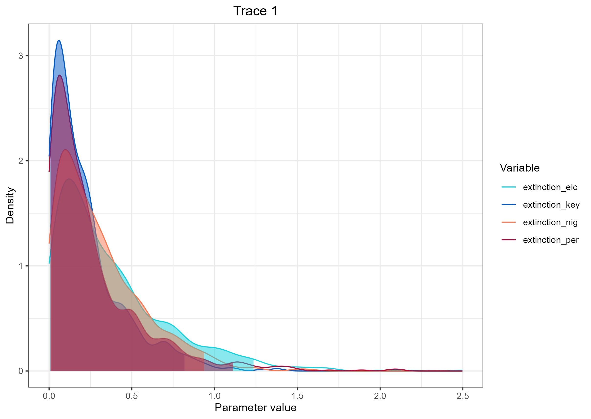
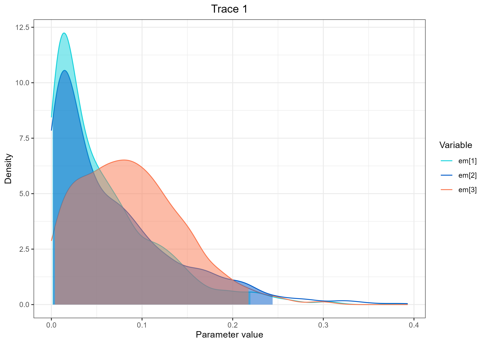

# PolymorSSE
 Polymorphic State Dependent Speciation and Extinction

## Introduction 

This is a natural extension of the SSE model designed to be used a polymorphic trait in the species/population tree. In this model, the trait must go through a polymorphic state before being fixed as monomorphic (Revell and Harmon 2022; see also Benítez-Álvarez et al. 2020; Zhang et al. 2020; Halali et al. 2021). It can be used for studying sexual dimorphism evolution, or any kind of polymorphic trait. It naturally accounts for possible ancestral polymorphism in phenotype and might be used even if a polymorphic species/population is not observed in the data (although simulation tests should be done indicate the power and identifiability of the model). Nevertheless, it is model of phenotypic evolution which is appropriate when it unlikely that a state is entirely replaced by another in one generation, specially when dealing with recently diverged taxa in the interface between population and species.  
  
We are interested in testing (1) whether any combination of male and female colors had been disfavored (selected against) or (2) whether any color on any sex had ben disfavored during their evolutionary time.

>[!Important]
> If you use this model, please refer to this GitHub page and cite Azevedo et al. (in prep)  
>  
> Azevedo G.H.F., Oliveira U., Santos F.R.,  Vidigal H.D.A., Brescovit A.D, Santos A.J. (in prep). Testing cohesive selective paths and evaluating information loss while delimiting species of Brazilian wandering spiders

  
> [!Note]
>> We are referring to the the birth rate of the model as a population formation rate, since we are using a population level tree but could be the speciation rate on a species level tree.
 

## Setup  

This tutorial requires [RevBayes](https://revbayes.github.io/) with the [Tensorphylo (May and Meyer)](https://bitbucket.org/mrmay/tensorphylo/src/a1314e61f180bd46a4de529bc6d26c434d1d442a/doc/preprint/preprint.pdf) plugin. [Download RevBayes](https://revbayes.github.io/download) or check the [RevBayes compilation instruction page](https://revbayes.github.io/compile-linux). Follow the instruction for [installing Tensorhylo here](https://bitbucket.org/mrmay/tensorphylo/src/master).


## PolymorSSE in RevBayes  
### Getting started

Clone this github directory, start RevBayes from your [scripts](./scripts) directory and load tensor file.  

```R
git clone LINK

cd polymorsse/scripts

rb 

tensor_path = YOUR_TENSORPHYLO_PATH
loadPlugin("TensorPhylo", tensor_path)
```  

Set seed if you want to replicate the analysis.
```R
seed(1)
```  

Set the path to inputs and outputs  

```R
workDirPath = "../"
dataDirPath = workDirPath + "data/"
outDirPath = workDirPath + "outputs/"
outputPrefix = "Pho_PolymorSSE"
dataMatrix = dataDirPath + "Pho_PolyColorMatrix.tsv"
treeFile = dataDirPath + "Pho_Trees.tre" 
``` 
Create helpers variables vor the moves and monitors.
```R
moves = VectorMoves()
monitors = VectorMonitors()
```  


### The Data  

We are analyzing the main ventral color of the abdomen that is present in three states:

| Ventral_Color | State  |  
| --------------|--------|  
| Brown         | 0      |  
| Black         | 1      |  
| Red             | 2      |  
 
This trait can be sexually dimorphic, so we can have a matrix with two traits, one for the male and another for the female:

| Female_Ventral_Color_State | Male_Ventral_Color_State  | 
| --------------|--------|  
| 0         | 0      |  
| 1         | 1      |  
| 2         | 2      |  

Therefore there are 9 possible combination of states in both females and males:

| Female | Male | Bits | Combined State |  
|--------|------|------|----------------|  
| 0      | 0    | 00  -| 0               |  
| 0      | 1    | 01  -| 1              |  
| 0      | 2    | 02  -| 2              |  
| 1      | 0    | 10  -| 3              |  
| 1      | 1    | 11  -| 4              |  
| 1      | 1    | 12  -| 5              |  
| 2      | 0    | 20  -| 6              |  
| 2      | 1    | 21  -| 7              |  
| 2      | 2    | 22  -| 8              |  


Each terminal in our data matrix should have one of the nine combined states.  
> Note: Since it is a sexual dimorphism, only the combination of two states is allowed. You can work on other types of polymorphisms and allow for any number of combinations you think it makes sense for your data. Remember that the more final states you have, more complex is the model similar to what is commented for biogeographical models [here]().

Now that we know the structure of the data we can read the matrix

Read data matrix and indicate number of states
```R
n_states = 9
data_matrix = readCharacterDataDelimited(dataMatrix, stateLabels="9", type="NaturalNumbers", delimiter="\t", header=TRUE)
```  
  
Read Tree  
```R
trees <- readTrees(treeFile)
# Since our file has more than one tree, we need to indicate which are we using. We chose the MSC+Morphology tree (index = 2).
tree_to_use <- 2
phylogeny <- trees[tree_to_use]

# If you have just one tree use:
# phylogeny <-  readTrees(treeFile)[1]
```

Get taxa 
```R
taxa = trees[tree_to_use].taxa()
```  
### Trait substitution rates (Q matrix)

Only trait transitions that represents a single sex change is allowed. Since we are interested in the rates in which color in each sex is replaced by others, we used six transition rates.

We want a rate matrix that would look like this:  

|   | 0  | 1   | 2    | 3   | 4   | 5   | 6   | 7   | 8   |  
|---|---|---|---|---|---|---|---|---|---| 
|0    | -     | em<sub>1</sub> | em<sub>1</sub> | ef<sub>1</sub> | 0     | 0     | ef<sub>1</sub> | 0     | 0
|1    | em<sub>2</sub> | -     | em<sub>2</sub> | 0     | ef<sub>1</sub> | 0     | 0     | ef<sub>1</sub> | 0
|2      | em<sub>3</sub> | em<sub>3</sub> | -     | 0     | 0     | ef<sub>1</sub> | 0     | 0     | ef<sub>1</sub>
|3    | ef<sub>2</sub> | 0     | 0     | -     | em<sub>1</sub> | em<sub>1</sub> | ef<sub>2</sub> | 0     | 0
|4    | 0     | ef<sub>2</sub> | 0     | em<sub>2</sub> | -     | em<sub>2</sub> | 0     | ef<sub>2</sub> | 0
|5      | 0     | 0     | ef<sub>2</sub> | em<sub>3</sub> | em<sub>3</sub> | -     | 0     | 0     | ef<sub>2</sub>
|6      | ef<sub>3</sub> | 0     | 0     | ef<sub>3</sub> | 0     | 0     | -     | em<sub>1</sub> | em<sub>1</sub>
|7      | 0     | ef<sub>3</sub> | 0     | 0     | ef<sub>3</sub> | 0     | em<sub>2</sub> | -     | em<sub>2</sub>
|8        | 0     | 0     | ef<sub>3</sub> | 0     | 0     | ef<sub>2</sub> | em<sub>3</sub> | em<sub>3</sub> | -


Where: 
em<sub>1</sub> is the extirpation of brown male (substitution of brown by any other color in males).  
em<sub>2</sub> is the extirpation of black male (substitution of black by any other color in males).  
em<sub>3</sub> is the extirpation of the red male (substitution of red by any other color in males).  

ef<sub>1</sub> is the extirpation of brown female.  
ef<sub>2</sub> is the extirpation of black female.  
ef<sub>3</sub> is the extirpation of the red female.  

We create a global extirpation rate for each sex, and then we use a Dirichlet distribution to sample proportional rates. The final rate is the product of the proportional rates and the global rate.

```R
# define the rate (1/mean) of the exponential distribution of extirpation rates
male_e_expoRate <- 10
# Define the global extinction for males
global_male_extirp ~ dnExp(male_e_expoRate)
moves.append(mvScale(global_male_extirp, weight=1))

# Define the Dirichlet distribution for male relative rates
n_states_male <- 3 
male_relative ~ dnReversibleJumpMixture( simplex(rep(1, n_states_male)), dnDirichlet(rep(1, n_states_male)), p=0.5 )
moves.append( mvRJSwitch(male_relative , weight=1.0) )
moves.append( mvDirichletSimplex( male_relative, weight=1 ) )

# create male state dependent rate variable 
em := male_relative * global_male_extirp

# Do the same for female rates
female_e_expoRate <- 10
global_female_extirp ~ dnExp(female_e_expoRate)
moves.append(mvScale(global_female_extirp, weight=1))

n_states_female <- 3
female_relative ~ dnReversibleJumpMixture( simplex(rep(1, n_states_female)), dnDirichlet(rep(1, n_states_female)), p=0.5 )
moves.append( mvRJSwitch(female_relative , weight=1.0) )
moves.append( mvDirichletSimplex( female_relative, weight=1 ) )

is_female_extirpation_different := ifelse( female_relative == simplex(rep(1,n_states_female)), 0.0, 1.0)

ef := female_relative * global_female_extirp
```

Now we create the Q matrix

```R
r[1][1] <- 0
r[1][2] := em[1]
r[1][3] := em[1]
r[1][4] := ef[1]
r[1][5] <- 0
r[1][6] <- 0
r[1][7] := ef[1]
r[1][8] <- 0
r[1][9] <- 0

r[2][1] := em[2]
r[2][2] <- 0
r[2][3] := em[2]
r[2][4] <- 0
r[2][5] := ef[1]
r[2][6] <- 0
r[2][7] <- 0
r[2][8] := ef[1]
r[2][9] <- 0

r[3][1] := em[3]
r[3][2] := em[3]
r[3][3] <- 0
r[3][4] <- 0
r[3][5] <- 0
r[3][6] := ef[1]
r[3][7] <- 0
r[3][8] <- 0
r[3][9] := ef[1]

r[4][1] := ef[2]
r[4][2] <- 0
r[4][3] <- 0
r[4][4] <- 0
r[4][5] := em[1]
r[4][6] := em[1]
r[4][7] := ef[2]
r[4][8] <- 0
r[4][9] <- 0

r[5][1] <- 0
r[5][2] := ef[2]
r[5][3] <- 0
r[5][4] := em[2]
r[5][5] <- 0
r[5][6] := em[2]
r[5][7] <- 0
r[5][8] := ef[2]
r[5][9] <- 0

r[6][1] <- 0
r[6][2] <- 0
r[6][3] := ef[2]
r[6][4] := em[3]
r[6][5] := em[3]
r[6][6] <- 0
r[6][7] <- 0
r[6][8] <- 0
r[6][9] := ef[2]

r[7][1] := ef[3]
r[7][2] <- 0
r[7][3] <- 0
r[7][4] := ef[3]
r[7][5] <- 0
r[7][6] <- 0
r[7][7] <- 0
r[7][8] := em[1]
r[7][9] := em[1]

r[8][1] <- 0
r[8][2] := ef[3]
r[8][3] <- 0
r[8][4] <- 0
r[8][5] := ef[3]
r[8][6] <- 0
r[8][7] := em[2]
r[8][8] <- 0
r[8][9] := em[2]

r[9][1] <- 0
r[9][2] <- 0
r[9][3] := ef[3]
r[9][4] <- 0
r[9][5] <- 0
r[9][6] := ef[2]
r[9][7] := em[3]
r[9][8] := em[3]
r[9][9] <- 0
``` 

Now you can create the rate matrix using the function fnFreeK. We do not rescale because we are using absolute rates (not relative rates).    

```R
Q := fnFreeK(r, rescaled=false)
```  

### Lineage extinction rates
We use a exponential distribution with rate=1 for the prior on the state dependent lineage extinction and  birth rates.
We use use RJ to test for equal rates between target species pairs (i.e, extinction rates of the states observed in the target species pairs). If you are not interested in testing this, you can use a loop as done below for the birth rates.

```R
e_expoRate <- 1
extinction_rates[1] ~ dnExp(e_expoRate)
moves.append(mvScale(extinction_rates[1], weight=1))

extinction_rates[2] ~ dnExp(e_expoRate)
moves.append(mvScale(extinction_rates[2], weight=1))

extinction_rates[3] ~ dnExp(e_expoRate)
moves.append(mvScale(extinction_rates[3], weight=1))

extinction_rates[4] ~ dnExp(e_expoRate)
moves.append(mvScale(extinction_rates[4], weight=1))

extinction_rates[5] ~ dnExp(e_expoRate)
moves.append(mvScale(extinction_rates[5], weight=1))

extinction_rates[6] ~ dnReversibleJumpMixture( extinction_rates[5], dnExp(e_expoRate), p=0.5 )
moves.append( mvRJSwitch(extinction_rates[6] , weight=1.0) )
moves.append(mvScale(extinction_rates[6], weight=1))

extinction_rates[7] ~ dnExp(e_expoRate)
moves.append(mvScale(extinction_rates[7], weight=1))

extinction_rates[8] ~ dnExp(e_expoRate)
moves.append(mvScale(extinction_rates[8], weight=1))

extinction_rates[9] ~ dnReversibleJumpMixture( extinction_rates[1], dnExp(e_expoRate), p=0.5 )
moves.append( mvRJSwitch(extinction_rates[9] , weight=1.0) )
moves.append(mvScale(extinction_rates[9], weight=1))

# Create a variable to track the probability of estate specific extinction being different
is_extinction_eic_nig_different := ifelse(extinction_rates[6] == extinction_rates[5], 0, 1)
is_extinction_key_per_different := ifelse(extinction_rates[9] == extinction_rates[1], 0, 1)
```

To facilitate visualization, we create variables to track the rate associated with the extinction for the traits observed in each target species.
```R
extinction_per := extinction_rates[1]
extinction_eic := extinction_rates[5]
extinction_nig := extinction_rates[6]
extinction_key := extinction_rates[9] 
```
### Lineage extinction rates  

Since we are using a population level tree, the birth parameter represents the rate that populations are formed. We have no previous hypothesis on how we should expect the polymorphism of the ventral abdominal color to influence this parameter. Therefore, for simplification we will assume no influence of the trait state on the speciation rate without compromising our hypothesis testing. 
We will used a exponential prior for the birth rate as well.

```R 
birth_expRate <- 1
birth ~ dnExp(birth_expRate)
moves.append(mvScale(birth, weight=1))

for (i in 1:n_states){
    stateBirths[i] := birth / n_states
    }
```

### Prior on root state
 We are using a flat Dirichlet distribution as the prior on each state. 
 
```R
root_state_freq ~ dnDirichlet(rep(1,n_states))
moves.append(mvSimplex(root_state_freq, 
                       weight=root_state_freq.size()/2))
```

### The probability of sampling an extant population
Since we have a population tree, our rho parameter represents the probability of sampling a population.
This can be difficult to know, but it is important to set a informative prior.
We will use a uniform distribution between 0.33 and 0.66, assuming that we have sample around two and three thirds of all populations.

```R
n_min = 0.33
n_max = 0.66
sampling_fraction ~ dnUniform(n_min, n_max)
moves.append( mvScale(sampling_fraction, weight=1) )
```  

### The time tree model
Lastly, we create an stochastic node for the time tree and associate it with the observed phylogeny and the data matrix.
```R
n_cores=9
root_age := phylogeny.rootAge()

timetree ~ dnGLHBDSP(
    rootAge     = root_age,
    lambda      = stateBirths,
    mu          = extinction_rates,
    eta         = Q,
    pi          = root_state_freq,
    condition   = "time",
    nStates     = n_states,
    taxa        = taxa,
    rho         = sampling_fraction,
    nProc       = n_cores
)

# Clamp to observed data
timetree.clamp(phylogeny)
timetree.clampCharData(data_matrix)
```


### The MCMC
Define the number of generations, burn in and print frequency
```R
## Number of generations
n_gen = 1000000
## Print to screen every x generations
n_print_screen = 1000
## Print parameters to file every x generations
n_print_log = 1000
## Print tree to file every x generations
n_print_tree = 1000
## Number of idependent runs
n_runs = 1
## Create checkpoint file every x generations
n_check_interval = 1000
## Burn in
burnin_percentage = 0.10 
```

Monitor variables of interest
```R
# print to screen
monitors.append( mnScreen(printgen=n_print_screen) )

# monitor parameters
monitors.append( mnModel(file=outDirPath+outputPrefix+".model.log", printgen=n_print_log) )

# monitor tree
monitors.append( mnFile(phylogeny, filename=outDirPath+outputPrefix+".tre", printgen=n_print_tree) )

# monitor ancestral states
monitors.append( mnJointConditionalAncestralState(tree=phylogeny,
                                                  glhbdsp=timetree,
                                                  type="NaturalNumbers",
                                                  withTips=TRUE,
                                                  withStartStates=FALSE,
                                                  filename=outDirPath+outputPrefix+".cond.states.log",
                                                  printgen=n_print_log) )

# monitor stochastic mappings
monitors.append( mnStochasticCharacterMap(glhbdsp=timetree,
                                          filename=outDirPath+outputPrefix+".stoch.log",
                                          printgen=n_print_log) )

# Monitor branch rates
monitors.append( mnStochasticBranchRate(glhbdsp=timetree,
                                        printgen=n_print_tree,
                                        filename=outDirPath+outputPrefix+".BirthDeathBrRates.log") )
```

Now we can build the model object using one of the variables, create the MCMC object and run

```R
mymodel = model(timetree)

mymcmc = mcmc(mymodel, monitors, moves, nruns=n_runs, combine="mixed")

mymcmc.run(n_gen, checkpointFile=outDirPath+outputPrefix+".checkpoint", 
           checkpointInterval= n_check_interval )
```

## Process results
We can now summarize the results

```R
# get ancestral state trace
state_trace = readAncestralStateTrace(file=outDirPath+outputPrefix+".cond.states.log")
# get ancestral state tree trace
state_tree_trace = readAncestralStateTreeTrace(file=outDirPath+outputPrefix+".tre", treetype="clock")
# compute burnin
n_burn = floor(burnin_percentage * state_tree_trace.getNumberSamples())


# Compute ancestral state tree
# Conditional reconstruction on target tree
anc_tree_conditional_target = ancestralStateTree(tree=phylogeny,
                              ancestral_state_trace_vector=state_trace,
                              tree_trace=state_tree_trace,
                              include_start_states=true,
                              file=outDirPath+outputPrefix+".ase.cond.tre",
                              burnin=n_burn,
                              summary_statistic="MAP",
                              reconstruction="conditional",
                              site=1)

# Marginal reconstruction on target tree
anc_tree_marg_target = ancestralStateTree(tree=phylogeny,
                              ancestral_state_trace_vector=state_trace,
                              tree_trace=state_tree_trace,
                              include_start_states=true,
                              file=outDirPath+outputPrefix+".ase.marg.tre",
                              burnin=n_burn,
                              summary_statistic="MAP",
                              reconstruction="marginal",
                             site=1)

# Stochastic map
# Stochastic map target
anc_states_stoch_map = readAncestralStateTrace(outDirPath+outputPrefix+".stoch.log")
summarizeCharacterMaps(anc_states_stoch_map,phylogeny,file=outDirPath+outputPrefix+"charmapTarget.tsv",burnin=n_burn)
char_map_tree_marginal_targ = characterMapTree(tree=phylogeny,
                                 ancestral_state_trace_vector=anc_states_stoch_map,
                                 character_file=outDirPath+outputPrefix+".char.map.marg.target.tre",
                                 posterior_file=outDirPath+outputPrefix+".pp.map.marg.Target.tre",
                                 burnin=burnin_percentage,
                                 reconstruction="marginal",
                                 num_time_slices=500)
```

## Plotting results
You can use the script [polymorsse_plotTreeAncState.R](scripts/polymorsse_plotTreeAncState.R) to plot the tree with ancestral states.


You can check the distribution of parameters using RevGadgets. The file [plotPosterior.R](scripts/plotPosterior.R) contains a script.




